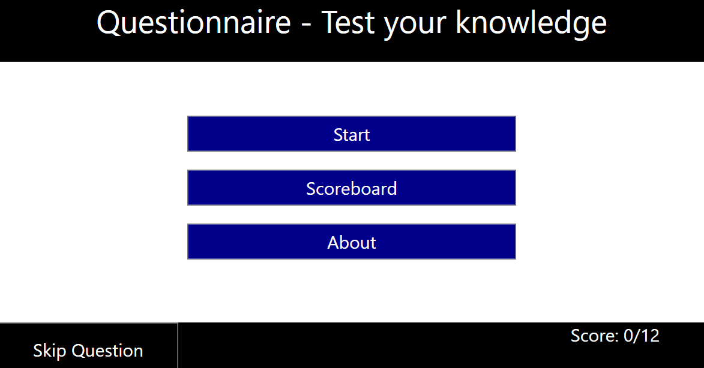
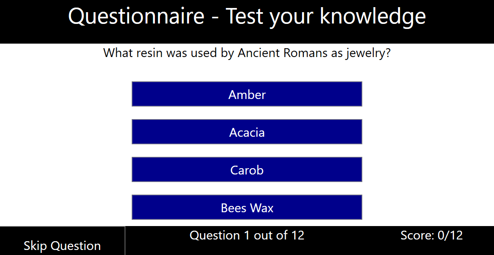
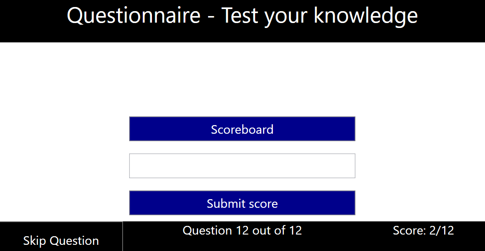
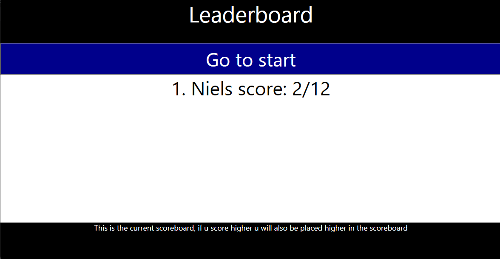
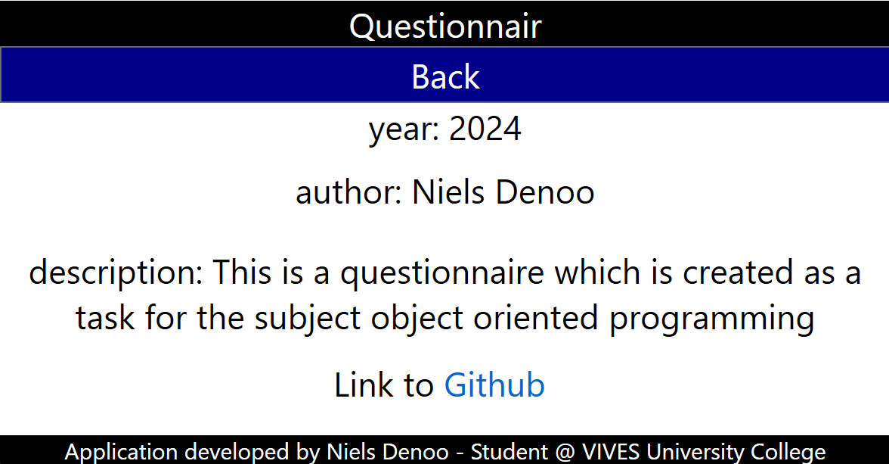
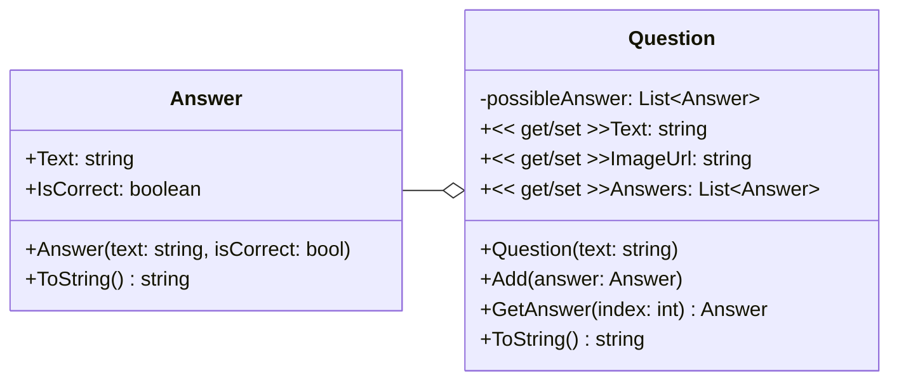
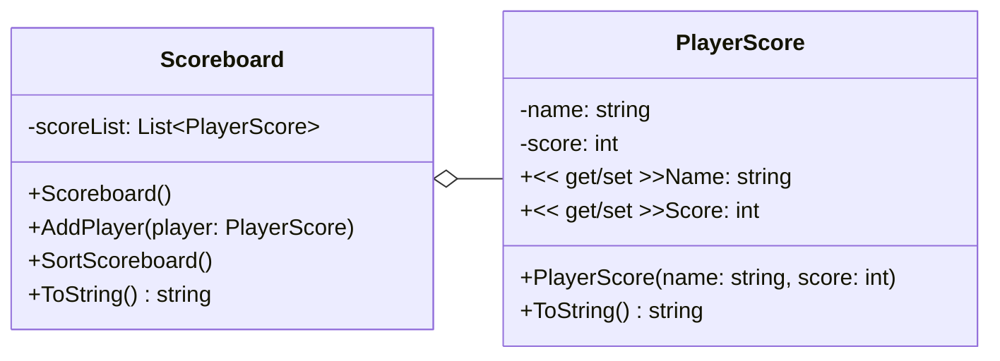

# Questionnary Game

## Project Description

The Questionnary Game is a trivia quiz application implemented in WPF. It features a friendly user interface where users can answer multiple-choice questions, track their scores, and view a scoreboard.

- **QuestionnaryLibrary**: Manages question and answers.
- **ConsoleApp**: This is to test the classes.
- **Questionnaire-The-Game**: The main question game with scoreboardwindow included.
- **TriviaApiLibrary**: Retrieves trivia questions from an API.
- **ScoreboardLibrary**: Manages the scoreboard and player scores.

## Author

This app is made by Niels Denoo during his studies at VIVES Brugge 2024.

## Screenshots

- Start window

- Questions

- SubmitUser

- Scoreboard

- Aboutwindow

## Setup and Usage

To use this application u need to install Visual Studio. You can do this by following [Link](https://visualstudio.microsoft.com/vs/community/). After installation u need to run QuestionnaireLibrary.sln in visual studio.

## UML Class Diagrams

### QuestionnaireLibrary

### Scoreboardlibrary

## Future Improvements

- **Add difficulty choice**: Allow users to select harder or easier questions instead of mixing all together.